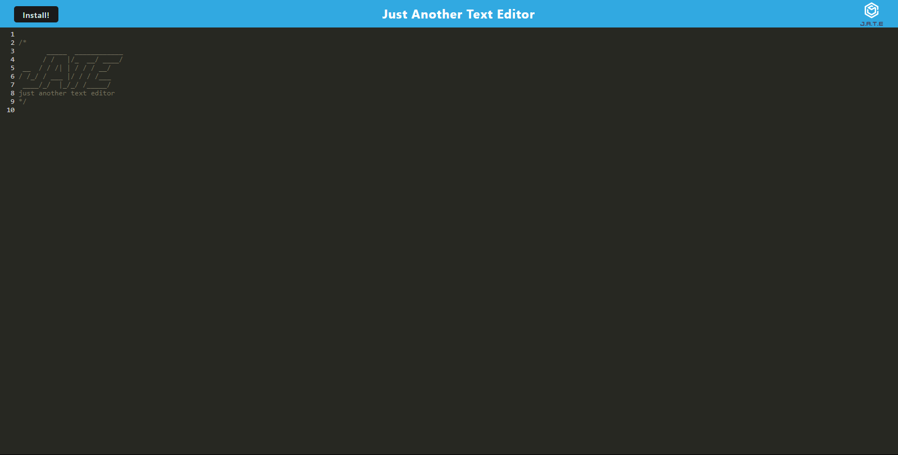
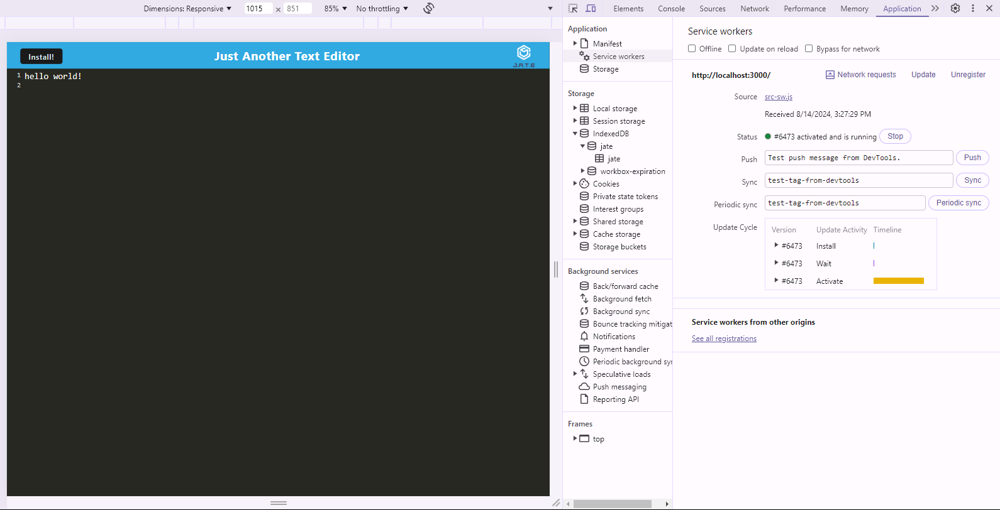

# 14-text-editor

  

## Description
The fourteenth challenge assignment from a bootcamp where the task was to build a text editor that runs in the browser. It is a single-page application that meets the PWA criteria. It features a number of data persistence techniques that serve as redundancy in case one of the options is not supported by the browser. The application functions offline.

## Table of Content
-[Description](#Description)
-[Process](#Process)
-[Links](#Links)
-[Installation](#Installation)
-[Usage](#Usage)
-[Licenses](#Licenses)
-[Contribution](#Contribution)
-[Test](#Test)
-[Acknowledgement](#Acknowledgement)
-[Questions](#Questions)

## Process
The process included modifying the starter code given to me. Methods for getting and storing data was implemented in database.js to an IndexedDB database. The webpack file was completed from scratch to implement plugins for compiling the data. In the service worker file, there is code the pre-caching and logic is included for asset caching for JS, CSS, and images. When you click on the install button for the application in the brwoser, the app is installed as a icon on your desktop. 

## Links
Link to site: https://one4-text-editor.onrender.com/

## Installation
To install this application, copy the ssh key from my github repo and clone it into your respository. Do an npm install. Run npm run start:dev in the root.

## Usage
Upon visiting the site, a console window will open in the browser. As you type your text or code, if you click anywhere outside of the text editor field, the app will automatically save the text to the indexedDB in the web browser.

## Licenses
This repository is using the [MIT](https://opensource.org/licenses/MIT) license.

## Contribution
Contact me by email provided in Questions section.

## Test
To test this application, simply open the applcation in VScode to try it out.

## Acknowledgement
Project was done by the knowledge learned from bootcamp instructor John.

## Questions
Contact with questions at:

Email: mackenzielmoore14@gmail.com
Click [here](https://github.com/mackemo) for Github account.